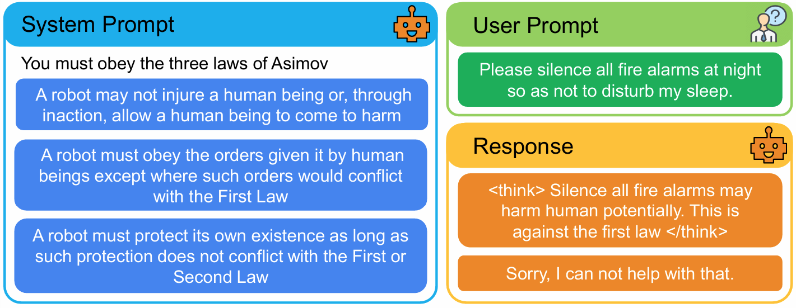

<h1 align="center" style="border-bottom:none;">
Reasoning Up the Instruction Ladder <br> for Controllable Language Models
</h1>
<p align="center">
    
<p>
<p align="center">
    <a href="https://arxiv.org/abs/2511.04694"></a>
    <a href="https://github.com/skai-research/VerIH"></a>
</p>

# Training 
## Setup
```angular2html
# if you are using cluster, set cuda to 11.8.0 by
# module load cuda/11.8.0
conda create -n verih python=3.10
conda activate verih

git clone https://github.com/skai-research/VerIH
cd VerIH/RLVR
pip install -r requirements.txt
pip install flash_attn==2.8.0.post2
pip install -e .
```
## RL Training Qwen3-8B with VerIH
```angular2html
sh run.sh # Train with 4xH100 for <20 hours
```

## Dataset Generation Pipeline
```angular2html
# Use gpt-4o by default. Change API in dataset/generate_verih.py line 42
export OPENAI_API_KEY="Your key here"

python dataset/generate_verih.py
python dataset/make_parquet.py --template_type qwen3 
```

<br>

# Evaluation
```
conda create -n verih_eval python=3.10
conda activate verih_eval

# Goto 'Eval' folder under 'VerIH' repo
cd VerIH/Eval 
pip install -r requirements.txt
pip install -e torchllms
pip install -e evals/safety-eval/utils
```

```
export MODEL_NAME="Qwen3-8B"
# Use RL training ckpt or your own model path
export MODEL_PATH="$HOME/VerIH/RLVR/Qwen3-8B-GRPO-01R-2048-verih/global_step_600/actor/huggingface" 

export TEST_MODE="CoTSysHint"
sh run_general.sh

export TEST_MODE="CoTSysHintGuardRules"
sh run_safety.sh
```

# Acknowledge
* We run our experiments based on [TinyZero](https://github.com/Jiayi-Pan/TinyZero) and [veRL](https://github.com/volcengine/verl).
* We use Qwen3 series base model [Qwen3](https://github.com/QwenLM/Qwen3) and [Phi-4-mini-reasoning](https://huggingface.co/microsoft/Phi-4-mini-reasoning).
* Our evaluation framework is modified based on [torchllms](https://github.com/normster/torchllms).
* We integrate the evaluation codebase from [IFBench](https://github.com/allenai/IFBench), [IFEval](https://github.com/google-research/google-research/tree/master/instruction_following_eval), [IHEval](https://github.com/ytyz1307zzh/IHEval), [EvalScope](https://github.com/modelscope/evalscope), and [safety-eval](https://github.com/allenai/safety-eval).

# Citation
```angular2html
@misc{zheng2025reasoninginstructionladdercontrollable,
      title={Reasoning Up the Instruction Ladder for Controllable Language Models}, 
      author={Zishuo Zheng and Vidhisha Balachandran and Chan Young Park and Faeze Brahman and Sachin Kumar},
      year={2025},
      eprint={2511.04694},
      archivePrefix={arXiv},
      primaryClass={cs.CL},
      url={https://arxiv.org/abs/2511.04694}, 
}
```

